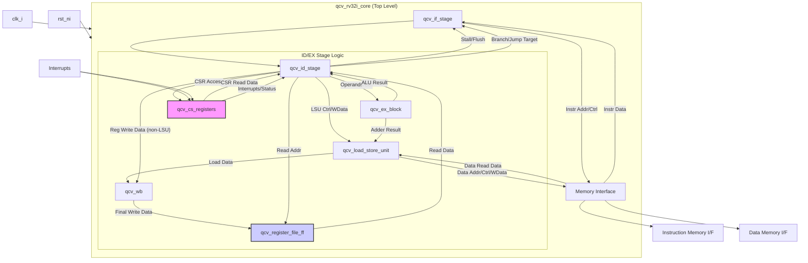

# QCV RV32I Core 仕様書 (Verilog版) - v0.1

## 1. はじめに

### 1.1. 概要

本仕様書は、RISC-V RV32I 基本整数命令セットをサポートする独自CPUコア (QCV) を Verilog HDL (Verilog-2001) で実装するための仕様を定義する。
本バージョン(v0.1)では、段階的開発の第一歩として、RV32I の基本機能に焦点を当てる。

### 1.2. ターゲット

*   **ISA:** RISC-V RV32I (整数基本命令セット)
*   **実装言語:** Verilog HDL (Verilog-2001 準拠)
*   **パイプライン:** 2段パイプライン (IF, ID/EX)

## 2. 全体アーキテクチャ

### 2.1. コア内部ブロック図

*(注: デバッグインターフェース、PMP機能は v0.1 のスコープ外)*

### 2.2. パイプラインステージ

QCVは名目上2ステージパイプライン (IF, ID/EX) として動作する。

1.  **IF (Instruction Fetch):** `qcv_if_stage` が担当。命令メモリから命令をフェッチする。
2.  **ID/EX (Instruction Decode / Execute):** 複数の内部モジュール (`qcv_id_stage`, `qcv_ex_block`, `qcv_load_store_unit`, `qcv_register_file_ff`, `qcv_cs_registers`, `qcv_wb`) が連携して担当。命令デコード、レジスタ読み出し、実行、メモリアクセス、ライトバックを行う。マルチサイクル命令はこのステージで完了するまでストールする。

## 3. トップレベルモジュール (`qcv_rv32i_core`)

### 3.1. 役割

CPUコア全体のトップレベルモジュール。`qcv_if_stage`, `qcv_id_stage` などの内部モジュールを接続し、外部（メモリ、割り込み、デバッグ）とのインターフェースを提供する。

### 3.2. 入出力信号 

| 信号名             | 方向   | 幅     | 説明                                       |
| :----------------- | :----- | :----- | :----------------------------------------- |
| `clk_i`            | Input  | 1      | クロック信号                               |
| `rst_ni`           | Input  | 1      | 非同期リセット信号 (Active Low)            |
| `test_en_i`        | Input  | 1      | テスト用クロックゲート有効化 (初期は無視)  |
| `hart_id_i`        | Input  | 32     | ハートID (CSRで使用)                       |
| `boot_addr_i`      | Input  | 32     | ブートアドレス (リセット時の初期PC)        |
| **Instruction Memory Interface** |        |        |                                            |
| `instr_req_o`      | Output | 1      | 命令フェッチ要求                           |
| `instr_gnt_i`      | Input  | 1      | 命令フェッチ許可 (Grant)                   |
| `instr_rvalid_i`   | Input  | 1      | 命令フェッチデータ有効                     |
| `instr_addr_o`     | Output | 32     | 命令フェッチアドレス                       |
| `instr_rdata_i`    | Input  | 32     | 命令フェッチデータ                         |
| `instr_err_i`      | Input  | 1      | 命令フェッチエラー                         |
| **Data Memory Interface** |        |        |                                            |
| `data_req_o`       | Output | 1      | データアクセス要求                         |
| `data_gnt_i`       | Input  | 1      | データアクセス許可 (Grant)                 |
| `data_rvalid_i`    | Input  | 1      | データ読み込みデータ有効                   |
| `data_we_o`        | Output | 1      | データ書き込みイネーブル (1: Write, 0: Read) |
| `data_be_o`        | Output | 4      | データバイトイネーブル                     |
| `data_addr_o`      | Output | 32     | データアクセスアドレス                     |
| `data_wdata_o`     | Output | 32     | データ書き込みデータ                       |
| `data_rdata_i`     | Input  | 32     | データ読み込みデータ                       |
| `data_err_i`       | Input  | 1      | データアクセスエラー                       |
| **Interrupt Inputs** |        |        | (初期スコープ外、接続のみ考慮)             |
| `irq_software_i`   | Input  | 1      | ソフトウェア割り込み                       |
| `irq_timer_i`      | Input  | 1      | タイマ割り込み                             |
| `irq_external_i`   | Input  | 1      | 外部割り込み                               |
| `irq_fast_i`       | Input  | 16     | 高速割り込み (ベクトル)                    |
| `irq_nm_i`         | Input  | 1      | NMI (マスク不能割り込み)                   |
| `irq_pending_o`    | Output | 1      | 割り込み保留中フラグ (CSRから)             |
| **CPU Control Signals** |        |        |                                            |
| `fetch_enable_i`   | Input  | 1      | CPU動作許可 (クロックゲート制御用、v0.1では単純化) |
| `core_busy_o`      | Output | 1      | コア動作中フラグ (クロックゲート制御用、v0.1では単純化) |

*(注: メモリインターフェースの `gnt`, `rvalid` はハンドシェイクに使われる。)*

## 4. `qcv_if_stage` モジュール

### 4.1. 役割

プログラムカウンタ(PC)の管理と命令メモリへのアクセスを担当する。

### 4.2. 機能概要

*   現在のPC値を基に命令メモリアドレス (`instr_addr_o`) を生成し、要求 (`instr_req_o`) を発行。
*   メモリからの許可 (`instr_gnt_i`) とデータ有効 (`instr_rvalid_i`) を待ち、命令データ (`instr_rdata_i`) を取得。
*   取得した命令と現在のPC値を `qcv_id_stage` へ渡す (`instr_valid_id_o`, `instr_rdata_id_o`, `pc_id_o` など)。
*   `qcv_id_stage` からの指示 (`pc_set_i`, `pc_mux_i`, `branch_target_ex_i` など) に基づき、次のPC値を計算・更新する。分岐/ジャンプ/例外発生時にPCを設定する。
*   `qcv_id_stage` からのストール要求 (`id_in_ready_i` が Low) や、自身のメモリ待機 (`if_busy_o`) により動作を停止する。
*   命令フェッチ時のメモリエラー (`instr_err_i`) を検出し、`qcv_id_stage` へ通知する。(PMPエラーはv0.1スコープ外)
*   圧縮命令 (`instr_is_compressed_id_o`) の検出補助。(v0.1では非圧縮命令のみを想定)

## 5. `qcv_id_stage` モジュール

### 5.1. 役割

コアの制御中心。`qcv_if_stage` から命令を受け取り、デコード、レジスタ読み出し、実行ユニット (`qcv_ex_block`) への指示、CSR (`qcv_cs_registers`) アクセス、LSU (`qcv_load_store_unit`) へのリクエスト発行、例外処理、パイプライン制御（ストール、フラッシュ）を行う。

### 5.2. 機能概要 

*   命令デコードと制御信号生成 (`alu_operator_ex_o`, `mult_en_ex_o`, `div_en_ex_o`, `lsu_req_o`, `lsu_we_o`, `csr_access_o` など)。
*   レジスタファイル読み出し制御 (`rf_raddr_a_o`, `rf_raddr_b_o`, `rf_ren_a_o`, `rf_ren_b_o`) とデータ受け取り (`rf_rdata_a_i`, `rf_rdata_b_i`)。
*   `qcv_ex_block` へのオペランド供給 (`alu_operand_a_ex_o`, `alu_operand_b_ex_o`, `multdiv_operand_a_ex_o`, `multdiv_operand_b_ex_o`)。
*   `qcv_ex_block` からの実行結果受け取り (`result_ex_i`) と分岐判定結果受け取り (`branch_decision_i`)。
*   `qcv_load_store_unit` へのリクエスト発行 (`lsu_req_o`, `lsu_we_o`, `lsu_type_o`, `lsu_wdata_o`) と応答待ち (`lsu_resp_valid_i`)。
*   `qcv_cs_registers` へのアクセス制御 (`csr_access_o`, `csr_op_o`, `csr_op_en_o`) とデータ授受 (`csr_rdata_i`)。
*   例外検出（不正命令 `illegal_insn_o`, メモリエラー `lsu_load_err_i`, `lsu_store_err_i`, CSRエラー `illegal_csr_insn_i` など）と例外処理シーケンス制御 (`pc_set_o`, `pc_mux_o`, `exc_pc_mux_o`, `exc_cause_o`)。(v0.1では基本的な例外のみ)
*   割り込み処理制御 (`irq_pending_i`, `irqs_i`, `nmi_mode_o`)。(v0.1スコープ外)
*   デバッグ制御はv0.1スコープ外。
*   パイプライン制御:
    *   IFステージへのストール/実行許可 (`id_in_ready_o`)。
    *   IFステージへのPC書き換え指示 (`pc_set_o`, `pc_mux_o`)。
    *   IFステージへの命令有効クリア指示 (`instr_valid_clear_o`)。
*   `qcv_wb` へのライトバックデータ供給 (`rf_wdata_id_o`, `rf_we_id_o`)。

## 6. `qcv_ex_block` モジュール

### 6.1. 役割

算術論理演算 (ALU)、乗除算演算、分岐ターゲットアドレス計算、ロード/ストアアドレス計算を行う。

### 6.2. 機能概要

*   `qcv_id_stage` からの指示 (`alu_operator_i`, `multdiv_operator_i` など) とオペランド (`alu_operand_a_i`, `alu_operand_b_i` など) に基づき演算を実行。
*   ALU演算結果 (`result_ex_o`) を `qcv_id_stage` へ返す。
*   加算器結果（主にアドレス計算用）(`alu_adder_result_ex_o`) を `qcv_load_store_unit` へ供給。
*   分岐条件判定結果 (`branch_decision_o`) と分岐先アドレス (`branch_target_o`) を `qcv_id_stage` と `qcv_if_stage` へ供給。
*   マルチサイクル演算（乗除算）の状態管理と完了通知 (`ex_valid_o`)。

## 7. `qcv_load_store_unit` モジュール

### 7.1. 役割

データメモリインターフェースを担当し、ロード/ストア命令を実行する。

### 7.2. 機能概要 (qcv_core.v 内の接続から推測)

*   `qcv_id_stage` からのリクエスト (`lsu_req_i`, `lsu_we_i`, `lsu_type_i`) と `qcv_ex_block` からのアドレス (`adder_result_ex_i`) に基づき、データメモリへアクセス (`data_req_o`, `data_addr_o`, `data_we_o`, `data_be_o`, `data_wdata_o`)。
*   メモリからの応答 (`data_gnt_i`, `data_rvalid_i`, `data_rdata_i`, `data_err_i`) を待つ。
*   ロードデータ (`lsu_rdata_o`) を `qcv_wb` へ渡す。
*   メモリアクセスの完了 (`lsu_resp_valid_o`) やエラー (`load_err_o`, `store_err_o`) を `qcv_id_stage` へ通知。
*   メモリアクセス中のビジー状態 (`busy_o`) を通知。

## 8. `qcv_wb` モジュール

### 8.1. 役割

レジスタファイルへの最終的な書き込みデータを選択する。

### 8.2. 機能概要 (qcv_core.v 内の接続から推測)

*   `qcv_id_stage` からの書き込みデータ (`rf_wdata_id_i`, `rf_we_id_i`) と `qcv_load_store_unit` からのロードデータ (`rf_wdata_lsu_i`, `rf_we_lsu_i`) を受け取る。
*   命令の種類やメモリアクセスの完了状況 (`lsu_resp_valid_i`, `lsu_resp_err_i`) に応じて、最終的な書き込みデータ (`rf_wdata_wb_o`) と書き込みイネーブル (`rf_we_wb_o`) を決定し、`qcv_register_file_ff` へ供給する。
*   書き込み先アドレス (`rf_waddr_wb_o`) は `qcv_id_stage` から受け取ったもの (`rf_waddr_id_i`) をそのまま渡す。
*   パフォーマンスカウンタ用の信号 (`perf_instr_ret_wb_o` など) を生成する。

## 9. `qcv_register_file_ff` モジュール

### 9.1. 役割

RISC-Vの汎用レジスタ (x0-x31) を保持する。

### 9.2. 機能概要

*   32ビット幅のレジスタ x 32本。x0は常にゼロを返す。
*   `qcv_id_stage` からの読み出しアドレス (`raddr_a_i`, `raddr_b_i`) に対応するデータを非同期で出力 (`rdata_a_o`, `rdata_b_o`)。
*   `qcv_wb` からの書き込みアドレス (`waddr_a_i`)、書き込みデータ (`wdata_a_i`)、書き込みイネーブル (`we_a_i`) に基づき、クロック同期でレジスタを更新。

## 10. `qcv_cs_registers` モジュール

### 10.1. 役割

RISC-Vの制御・状態レジスタ (CSR) を管理し、割り込み、例外、デバッグ、パフォーマンスカウンタに関連する機能を提供する。

### 10.2. 機能概要 

*   `qcv_id_stage` からのCSRアクセス要求 (`csr_access_i`, `csr_addr_i`, `csr_wdata_i`, `csr_op_i`) を処理し、読み出しデータ (`csr_rdata_o`) を返す。
*   `mstatus`, `mie`, `mip`, `mepc`, `mcause`, `mtval`, `mtvec` などの主要なCSRを保持・更新。
*   割り込み入力 (`irq_*_i`) を受け付け、`mip` レジスタを更新し、割り込み保留状態 (`irq_pending_o`) を `qcv_id_stage` へ通知。
*   例外発生時のCSR更新 (`mepc`, `mcause`, `mtval`) を `qcv_id_stage` からの指示 (`csr_save_cause_i`, `csr_mcause_i`, `csr_mtval_i`) で行う。
*   `mret`, `dret` 命令によるCSRリストア制御 (`csr_restore_mret_i`, `csr_restore_dret_i`)。
*   現在の特権モード (`priv_mode_id_o`, `priv_mode_lsu_o`) を管理・通知。(v0.1ではMモードのみ想定)
*   デバッグ関連CSRはv0.1スコープ外。
*   パフォーマンスカウンタ (`mcycle`, `minstret` など) の管理。(v0.1では基本的なサイクルカウントのみ考慮)
*   PMP関連CSRインターフェースはv0.1スコープ外。

## 11. パイプライン制御とハザード

*   **ストール:** 主に `qcv_id_stage` が制御。
    *   ロード/ストア命令実行時のメモリ応答待ち。
    *   マルチサイクル演算（乗除算など、初期スコープでは未実装）の完了待ち。
    *   `WFI` 命令実行時。
    *   デバッグ停止時。
    *   ストール時、`qcv_id_stage` は `qcv_if_stage` に対して `id_in_ready_o` を Low にして命令供給を停止させる。
*   **フラッシュ:** 主に `qcv_id_stage` が制御。
    *   分岐/ジャンプ命令成功時。
    *   例外/割り込み発生時。
    *   `qcv_id_stage` は `qcv_if_stage` に `pc_set_o` と `pc_mux_o` で新しいPCを指示し、パイプラインをクリアさせる (`instr_valid_clear_o` などが関連する可能性あり)。
*   **データハザード:** 2段パイプラインのため、レジスタ読み出しと書き込みが同じID/EXステージ内で完結する。典型的なRead-After-Write (RAW) ハザードは発生しにくいが、ロード命令の結果を直後の命令で使う場合（Load-Useハザード）は、LSUからの応答を待つためのストールで解決される。フォワーディングパスは基本的に不要。

## 12. リセットと初期化

*   `rst_ni` (Active Low) により非同期リセット。
*   リセット時、PCは特定のアドレス（例: `32'h0000_0000`）に初期化される。
*   ID/EXステージの内部状態はクリアまたは無効状態に初期化される。

## 13. 例外処理 (初期スコープ)

*   本バージョン(v0.1)では、基本的な不正命令例外の検出のみを考慮する（検出時に特定の処理を行うかは別途検討）。
*   外部割り込み、タイマ割り込み、デバッグ機能などは将来の拡張スコープとする。
